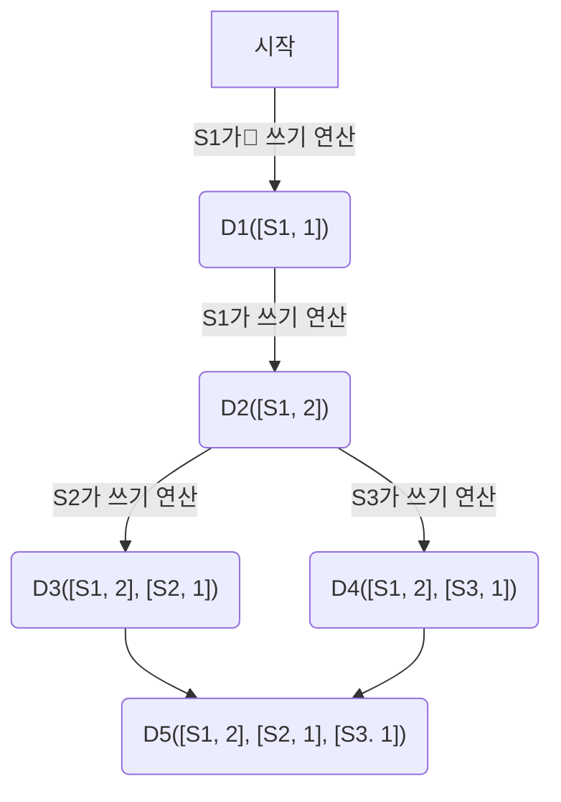

# 키-값 저장소 설계
- 아마존 다이나모
- memcached
- 레디스
## 문제 이해 및 설계 범위 확정
- 읽기 - 쓰기 - 메모리 사용량 간 균형을 찾아야 함.
```
1. 키-값 쌍의 크기는 10KB 이하
2. 큰 데이터를 저장
3. 높은 가용성 -> 시스템에 장애가 생겨도 빨리 응답
4. 높은 규모 확장성 -> 트래픽 양에 따라 자동적으로 증설/삭제
5. 데이터 일관성 수준은 조정 가능
6. 응답 지연시간은 짧아야함
```
## 단일 서버 키-값 저장소
- 가장 직관적인 방법
	- 키 - 값 쌍 전부를 메모리에 해시 테이블로...
		- 빠른 속도
		- 모든 데이터를 메모리 안에 두는 것은 불가능
		- 개선책
			- 데이터 압축
			- 자주 쓰이는 데이터 -> 메모리
			- 나머지는 디스크 저장
## 분산 키-값 저장소
- 분산 해시 테이블
- 키 - 값 쌍을 여러 서버에 분산
### CAP 정리
아래 3 가지 요구사항을 동시에 만족하는 분산 시스템을 설계하는 것이 불가능하다는 정리
1. 데이터 일관성 : C onsistency
	- 분산 시스템에 접속하는 모든 클라이언트는 접속한 노드에 관계없이 언제나 같은 데이터를 보게 되야함
2. 가용성 : A vailability
	- 일부 노드에 장애가 발생해도 항상 응답을 받을 수 있어야 함
3. 파티션 감내 : P artition tolerance
	- 네트워크에 파티션이 생겨도, 시스템은 계속 동작해야 함
	- 파티션 : 두 노드 사이에 통신 장애가 발생

1. CP 시스템: 데이터 일관성(Consistency) + 파티션 감내(Partition tolerance) 
	- 일관성과 파티션 감내를 지원 -> 가용성 희생
1. AP 시스템: 가용성(Availability) + 파티션 감내(Partition tolerance) 
	- 가용성과 파티션 감내를 지원 -> 데이터 일관성 희생
2. CA 시스템: 데이터 일관성(Consistency) + 가용성(Availability)
	- 일관성과 파티션 감내를 지원 -> 데이터 일관성 희생
	- 통상, 네이트워크 장애는 필연적 -> 파티션 감내는 필수 -> CA 시스템은 사실상 없음

CP vs AP
CP
- 가용성 희생
	- A, B, C 노드가 있음
	- 만약, C노드에 최신 데이터가 입력되었는데, C 노드에 문제
	- 데이터 일관성을 위해 A, B에 쓰기 작업을 중단해야 함 -> 가용성 희생
AP
- 일관성 희생
	- A, B, C 노드가 있음
	- ㅊㅊC 노드에 문제
	- A, B에서 낡은 데이터를 반환하더라도, 읽기, 쓰기 허용. 이후 C 노드 복구되면 C 노드 업데이트
# 키-값 저장소의 핵심 시스템 컴포넌트
## 데이터 파티션
- 데이터들을 작은 파티션들로 분할하고, 여러 서버에 저장해야 함.
- 파티션을 나눌 때 고려사항
	1. 데이터를 여러 서버에 고르게 분산할 수 있는가?
	2. 노드에 추가/삭제 시, 데이터의 이동을 최소화할 수 있는가?
	- `안정 해시`는 1, 2번 문제를 푸는데 적합한 기술
### 안정 해시 동작 원리 예시
1. 서버를 해시 링에 배치
2. 키를 링위에 배치
3. 배치한 키를 기준으로 링을 시계 방향으로 순회 -> 만나는 첫 번째 서버에 저장

안정해시 파티셔닝 장점
1. 규모 확장 자동화 (automatic scaling) 
	- 시스템 부하에 따라 서버가 자동으로 추가/삭제
2. 다양성 (heterogeneity)
	- 각 서버의 용량에 맞게 가상 노드 수를 조정
		-> 고성능 서버는 더 많은 가상 노드를 갖도록 설정 가능
## 데이터 다중화
높은 가용성과 안정성 확보를 위해 데이터를 `N`개의 서버에 비동기적으로 다중화해야 함.
- `N` 이 3이면, key 위치 기준 시계 방향으로 3개의 서버에 저장
### 주의 사항
가상 노드 사용 시, 같은 서버의 가상 노드가 중복되서, 실제 N은 작아질 수 있음.
-> 따라서, 가상노드 사용 시, 같은 **물리 서버가 중복되지 않도록 주의**
## 데이터 일관성
여러 노드에 다중화된 데이터는 적절히 동기화 되어야 함.
-> `정족수 합의 프로토콜`을 사용하면, 읽기/쓰기 연산 모두 일관성 보장 가능
### 정족수 합의 프로토콜
```
N = 사본 개수
W = 쓰기 연산에 대한 정족수, 쓰기 연산이 성공한 것으로 간주되려면 적어도 W개의 서버로부터 쓰기 연산이 성공했다는 응답을 받아야 함.
R = 읽기 연산에 대한 정족수, 읽기 연산이 성공한 것으로 간주되려면 적어도 R개의 서버로부터 응답을 받아야 함.
```
- 정족수 합의 구성 예시
	- R=1, W=N : 빠른 읽기 연산에 최적
	- W=1, R=N : 빠른 쓰기 연산에 최적
	- R+W > N : 강한 일관성
		- 모든 읽기 연산에 대해 가장 최근에 갱신된 결과를 반환
		- 즉, 클라이언트는 절대 낡은 데이터를 보지 못함
	- R+W <= N : 약한 일관성
		- 모든 읽기 연산에 대해 가장 최근에 갱신된 결과를 보장하지 못함
		- 결과적 일관성
			- 약한 일관성의 한 형태
			- 갱신 결과가 결국 모든 사본에 반영되는 모델
			- 다이나모, 카산드라
- 강한 일관성 달성 방법
	- 모든 사본에 쓰기 연산 결과가 반영될 때까지 해당 데이터에 대한 읽기/쓰기를 금지
	- 고가용성 시스템에는 적합하지 않음 (쓰기 연산이 반영되기 전까진 읽기/쓰기가 불가능하니까)
- 결과적 일관성
	- 쓰기 연산이 병렬적으로 발생 -> 시스템에 저장된 값의 일관성이 깨짐-> 클라이언트가 해결
	- 클라이언트 측에서 데이터의 버전 정보를 활용해 일관성이 깨진 데이터를 읽지 않음 (데이터 버저닝)
### 땟목 합의 알고리즘
(https://seongjin.me/raft-consensus-algorithm/)
분산 환경에서 모든 노드가 동일한 상태를 유지. -> 일부 노드 장애 시에도 전체 시스템은 정상
- 모든 노드는 `리더`, `팔로워`, `후보자` 상태를 가짐
- 리더
	- 클러스터를 대표하는 노드
	- 클라이언트가 클러스터로 보낸 모든 명령을 수신, 전파, 응답
	- 자신의 상태를 팔로워에게 전파
- 팔로워
	- 리더에게 받은 명령을 처리
- 후보자 
	- 리더가 없는 상황에서 새 리더를 정하기 위해 전환된 팔로워 상태
	- 리더로부터 일정시간 이상 상태 메시지를 받지 못한 팔로워는 후보자로 전환
## 일관성 불일치 해소
### 데이터 버저닝 기법
데이터를 변경할 때마다 해당 데이터의 새로운 버전을 생성. 각 버전의 데이터는 변경 불가
### 벡터 시계
[서버, 버전]의 순서쌍을 데이터에 부착
- D라는 데이터가 있으면, D([S1, V1], [S2, V2], ..., [Sn, Vn])과 같이 표현
데이터 D를 서버 Si에 기록하면 아래 작업 중 하나를 수행
1. [Si, Vi]이 있으면 Vi를 증가
2. 그렇지 않으면 새 항목 [Si, 1]를 만듬


- D3, D4에서 D5로 갈 때, 충돌을 해소 후 버저닝
- 
